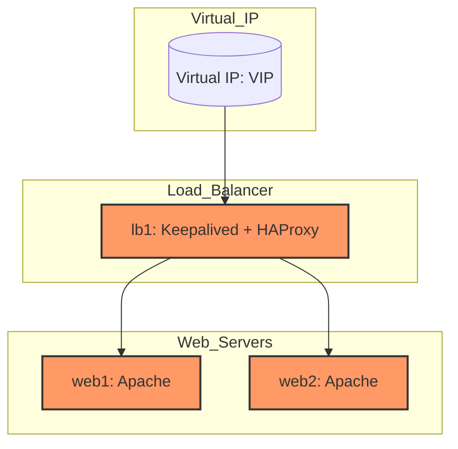

## **Project: High-Availability Apache Web Server with Keepalived and HAProxy on RHEL**

### **Objective:**

To create a high-availability Apache web server setup using `Keepalived` for failover and `HAProxy` for 
load balancing. The goal is to ensure minimal downtime and load distribution between two or more Apache 
web servers.



### **Project Overview:**

1.  Setup Red Hat Enterprise Linux (RHEL) Servers
2.  Install and Configure Apache Web Server
3.  Install and Configure HAProxy for Load Balancing
4.  Install and Configure Keepalived for Failover
5.  Test High Availability and Failover

----------

### **1. Setup Red Hat Enterprise Linux (RHEL) Servers**

-   **Provisioning:**
    
    -   Provision at least two RHEL servers (e.g., `web1` and `web2`) for Apache Web Servers.
    -   Provision an additional server for `HAProxy` and `Keepalived` (e.g., `lb1`).
-   **Basic Configuration:**
    
	 **Install Updates:**
    ```bash
    sudo yum update -y
	```
	**Set Hostnames:**
	```bash
	sudo hostnamectl set-hostname web1
	sudo hostnamectl set-hostname web2
	sudo hostnamectl set-hostname lb1
	```
	**Ensure Communication Between Servers:** All servers (`web1`, `web2`, and `lb1`) should be able 
to communicate with each other via the network.
    
	**Configure Firewall:** Allow HTTP, HTTPS, and HA traffic.
	```bash
	sudo firewall-cmd --permanent --add-service=http
	sudo firewall-cmd --permanent --add-service=https
	sudo firewall-cmd --permanent --add-service=keepalived
	sudo firewall-cmd --reload
	```

### **2. Install and Configure Apache Web Server**

**Install Apache on Both `web1` and `web2`:**

```bash
sudo yum install httpd -y
```

**Start and Enable Apache:**

```bash
sudo systemctl start httpd
sudo systemctl enable httpd
```
**Create a Test Web Page on Both Servers:**

-   On `web1`:
	```bash
	echo "<h1>Welcome to Web Server 1</h1>" | sudo tee /var/www/html/index.html
	```
- On `web2`:

```bash
echo "<h1>Welcome to Web Server 2</h1>" | sudo tee /var/www/html/index.html
```

### **3. Install and Configure HAProxy for Load Balancing**

-   **Install HAProxy on `lb1`:**
```bash
sudo yum install haproxy -y
```

**Configure HAProxy:**

-   Edit the HAProxy configuration file `/etc/haproxy/haproxy.cfg`:

```bash
global
    log 127.0.0.1 local2
    chroot /var/lib/haproxy
    pidfile /var/run/haproxy.pid
    maxconn 4000
    user haproxy
    group haproxy
    daemon

defaults
    log     global
    option  httplog
    option  dontlognull
    retries 3
    option redispatch
    timeout connect 5000
    timeout client  50000
    timeout server  50000

frontend http-in
    bind *:80
    default_backend webservers

backend webservers
    balance roundrobin
    option httpchk
    server web1 <web1-ip>:80 check
    server web2 <web2-ip>:80 check
```

** Start and Enable HAProxy: **

```bash 
sudo systemctl start haproxy
sudo systemctl enable haproxy
```

**Verify HAProxy Configuration:**

```bash
sudo haproxy -c -f /etc/haproxy/haproxy.cfg
```

### **4. Install and Configure Keepalived for Failover**

-   **Install Keepalived on `lb1`:**

```bash
sudo yum install keepalived -y
```

**Configure Keepalived for VIP (Virtual IP) Failover:**

-   Edit the Keepalived configuration file `/etc/keepalived/keepalived.conf`:
```bash
vrrp_instance VI_1 {
    state MASTER
    interface eth0
    virtual_router_id 51
    priority 100
    advert_int 1
    authentication {
        auth_type PASS
        auth_pass 12345
    }
    virtual_ipaddress {
        <VIP>
    }
}
```
**Start and Enable Keepalived:**

```bash
sudo systemctl start keepalived
sudo systemctl enable keepalived
```


### **5. Test High Availability and Failover**

-   **Access the VIP in a Browser:**
  Open a browser and enter the VIP address. You should be directed to either `web1` or `web2` based on 
load balancing.
  
-   **Simulate a Server Failure:**
    
	   Stop Apache on `web1`:

	```bash
	sudo systemctl stop httpd
	```
	 The traffic should now be automatically redirected to `web2`.
-   **Simulate Load Balancer Failover:**
    
    -   Stop Keepalived on `lb1`, and traffic should automatically failover to the backup load balancer 
(if one is configured).

### **Summary**

This project involves creating a high-availability Apache web server setup on RHEL using `HAProxy` for 
load balancing and `Keepalived` for failover. Apache is installed on multiple web servers, and HAProxy 
distributes incoming traffic between them. Keepalived ensures failover by assigning a Virtual IP (VIP) 
that moves between servers if one goes down.
